# ISP Platform 🌐

> **Sistema de gestión centralizada para ISPs / WISPs** con integración MikroTik RouterOS API, túneles VPN ZeroTier, facturación electrónica ecuatoriana (SRI) y monitoreo en tiempo real.

---

## 🗺️ Arquitectura del Sistema

El sistema está diseñado para interactuar de forma segura y eficiente con múltiples MikroTik RouterOS remotos o locales. Aunque el diseño por defecto y recomendado en producción sugiere el uso de túneles VPN ZeroTier (para evadir CGNAT y simplificar el ruteo), el backend se comunica mediante peticiones API sobre sockets TCP convencionales. Esto significa que **se soporta cualquier tipo de conectividad de red** (como IPs locales LAN, direcciones WAN públicas, Tailscale, WireGuard u otros túneles VPN) con solo registrar la dirección IP o host correspondiente.

A continuación se detallan los diagramas de arquitectura utilizando el flujo de referencia con ZeroTier:

### 1. Vista General de la Arquitectura


### 2. Flujo de Comunicación de Red


### 3. Lógica Interna del Backend


---

## 🛠️ Stack Tecnológico

El proyecto está estructurado como un monorepo para facilitar la gestión conjunta de todos los servicios.

### Backend (API & Workers)
* **Lenguaje:** Python 3.12+
* **Framework:** FastAPI (REST + WebSockets)
* **Base de Datos:** PostgreSQL 16 (con particionado mensual para muestras de tráfico)
* **Caché y Mensajería:** Redis 7 (broker de Celery y almacén de sesiones activas)
* **Tareas Asíncronas:** Celery & Celery Beat (health check periódico, recolección de tráfico, suspensiones automáticas)
* **Conectividad MikroTik:** `librouteros` (Pool de conexiones persistentes con reconexión automática)
* **ORM & Migraciones:** SQLAlchemy 2.0+ & Alembic 1.13+
* **Seguridad:** Cifrado Fernet para credenciales de routers y hashes de contraseñas de usuarios con bcrypt directo.

### Frontend (Panel Administrativo Web)
* **Framework:** React 18+ (Vite 5+ & TypeScript 5+)
* **Estilos:** Tailwind CSS 3.4+ & Componentes interactivos de **shadcn/ui**
* **Manejo de Estado:** Zustand (estado global) & TanStack Query v5 (caché e interactividad con el servidor)
* **Gráficos:** Recharts (tráfico en tiempo real y consumo de datos)
* **Mapas:** Leaflet (georreferenciación de clientes)
* **Formularios:** React Hook Form + validaciones estructuradas con Zod

### Aplicación Móvil (Técnicos de Campo)
* **Framework:** React Native + Expo (Expo Router para navegación orientada a archivos)
* **Estilos:** NativeWind (Tailwind CSS para componentes nativos)
* **Seguridad:** Almacenamiento local seguro con Expo SecureStore

---

## 📁 Estructura del Proyecto

```text
isp_platform/
├── backend/                  # Código fuente del backend (FastAPI)
│   ├── app/
│   │   ├── api/              # Routers FastAPI por módulo
│   │   ├── models/           # Modelos de base de datos SQLAlchemy
│   │   ├── schemas/          # Esquemas de validación Pydantic
│   │   ├── services/         # Lógica de negocio (MikroTik, SRI, etc.)
│   │   ├── core/             # Configuración del sistema, auth y seguridad
│   │   └── workers/          # Tareas asíncronas de Celery
│   ├── tests/                # Pruebas unitarias e integración (Pytest)
│   ├── alembic/              # Scripts de migración de base de datos
│   └── requirements.txt      # Dependencias del backend
├── frontend/                 # Panel web de administración (React)
│   ├── src/
│   │   ├── components/       # Componentes visuales comunes
│   │   ├── pages/            # Vistas por módulo de la plataforma
│   │   ├── stores/           # Almacenes de estado global (Zustand)
│   │   └── services/         # Clientes de consumo de API REST/WebSockets
├── architecture/             # Recursos visuales y diagramas SVG
├── nginx/                    # Archivos de configuración para proxy inverso
└── docker-compose.yml        # Orquestación de infraestructura en desarrollo
```

---

## 🚀 Inicio Rápido con Docker Compose

El proyecto incluye un entorno Docker optimizado que arranca todas las dependencias requeridas (Base de datos, Caché, API y Worker).

1. **Configurar el entorno:**
   Copia el archivo `.env.example` de la raíz a `.env` y define las variables de entorno principales (como las llaves de encriptación y base de datos):
   ```bash
   cp .env.example .env
   ```

2. **Levantar la infraestructura completa:**
   ```bash
   docker compose up --build
   ```

Este comando iniciará:
* **API Backend** en [http://localhost:8000](http://localhost:8000)
* **Frontend Web** en [http://localhost:5173](http://localhost:5173)
* **Adminer (Gestor DB)** en [http://localhost:8080](http://localhost:8080)
* **Redis y PostgreSQL** como bases de datos
* **Celery Worker & Beat** ejecutando tareas en segundo plano

---

## 💻 Desarrollo Local (Sin Docker)

Si prefieres ejecutar el código directamente en tu host local para un ciclo de desarrollo más ágil:

### Configuración del Backend

1. **Crear e iniciar el entorno virtual:**
   ```bash
   cd backend
   python3 -m venv .venv
   source .venv/bin/activate
   ```

2. **Instalar dependencias:**
   ```bash
   pip install -r requirements.txt
   ```

3. **Ejecutar el servidor Uvicorn en desarrollo:**
   ```bash
   uvicorn app.main:lifespan_app --reload --port 8000
   ```
   *(Nota: Asegúrate de tener instancias de PostgreSQL y Redis corriendo localmente y configuradas en el archivo `.env` del backend).*

### Configuración del Frontend

1. **Navegar e instalar paquetes de Node:**
   ```bash
   cd frontend
   npm install
   ```

2. **Ejecutar en modo dev:**
   ```bash
   npm run dev
   ```

---

## 🧪 Pruebas Unitarias y de Integración

El backend cuenta con una completa suite de pruebas unitarias que validan la autenticación, flujos de sesión, y endpoints de configuración.

Para correr las pruebas localmente usando una base de datos en memoria SQLite y mockeando Redis:

1. Instala las dependencias de testing:
   ```bash
   cd backend
   pip install -r requirements-test.txt
   ```

2. Corre la suite de pruebas mediante Pytest:
   ```bash
   DATABASE_URL="sqlite:///:memory:" REDIS_URL="redis://localhost:6379/0" SECRET_KEY="testkey123456789testkey123456789xx" FERNET_KEY="wlphuDlhKvtsvUg8lnnjWzNKJSP1dDzCZuYMFdhLcJg=" ENVIRONMENT=development python3 -m pytest tests/
   ```

---

## 🔒 Seguridad y Configuración Clave

* **Cifrado Fernet:** Las contraseñas de las APIs de MikroTik se almacenan cifradas en la base de datos PostgreSQL utilizando una clave AES Fernet única declarada en la variable `FERNET_KEY`. Nunca compartas ni pierdas esta variable en entornos de producción.
* **Seed de Administrador:** En el primer arranque, la aplicación autogenerará un usuario administrador inicial utilizando las credenciales provistas en el archivo `.env` (`ADMIN_SEED_EMAIL`, `ADMIN_SEED_PASSWORD`).
* **Endpoints de Auto-Configuración:** El sistema expone el endpoint `POST /api/auth/setup` para inicializar el administrador principal en instalaciones nuevas donde no exista ningún usuario en base de datos.
